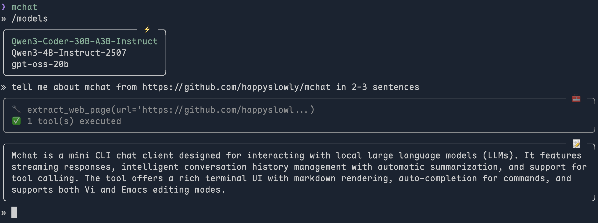

# mchat

A clean, fast terminal chat client for local LLMs with streaming responses, conversation history, and intelligent summarization.



## Features

- **Streaming responses** with thinking process display
- **Smart history management** with automatic summarization
- **Rich terminal UI** with markdown rendering
- **Auto completion** for commands
- **Vi/Emacs editing modes** via prompt-toolkit
- **Runtime model switching**
- **System prompt management**

## Installation

```bash
uv tool install .
# or for development
uv pip install -e .
```

## Configuration

Create `~/.config/mchat/config.toml`:

```toml
base_url = "http://localhost:8000/v1"
model = "your-model-name"
summary_model = "faster-model-for-summaries"  # optional
max_history_turns = 5  # conversation turns to keep in context
api_key = "optional-api-key"
```

## Usage

```bash
mchat
```

### Commands

- `/help` - Show available commands
- `/models` - List available models (\* = current)
- `/model <name>` - Switch to specified model
- `/system [prompt]` - View or set system prompt
- `/history_limit <N>` - Set max conversation turns to send
- `/show_history` - Print conversation history
- `/clear_history` - Clear conversation history
- `/edit_mode [vi|emacs]` - Switch editing mode
- `/quit` - Exit (or Ctrl+C/Ctrl+D)

## Requirements

- Python 3.12+
- Compatible with OpenAI API format endpoints

## TODO

- [ ] Web search integration (Brave API)
- [ ] MCP (Model Context Protocol) support
- [ ] Multiple conversation sessions
